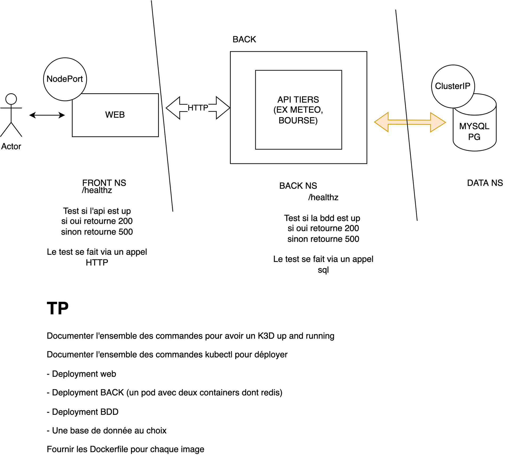

<div align="center">
<h1>TP Kubernetes</h1>
</div>

## Description

The goal of this project is to deploy a simple architecture using kubernetes. Here is a schema of the architecture:



It is composed of a Next js frontend rendering files in SSR (server side rendering). A Go API providing a /city/random and a /healthz route. And a Postgres database to store the data.
Each service are in different namespaces and only the frontend is exposed using a nodePort

### Installation

**Create the kubernetes** cluster using [k3d](https://k3d.io/v5.5.1/), if you don't have it installed you can follow the [installation guide](https://k3d.io/v5.5.1/#installation)

```
k3d cluster create kube
```

**Create the namespaces**

```
kubectl create ns frontend
kubectl create ns backend
kubectl create ns db
```

**Apply the charts**

```
kubectl apply -Rf ./kube
```

this might take a while, you can check the status of the pods using:

```
kubectl get pods -A
```

**Retrieve the ip and nodeport of the frontend**

```
kubectl get svc -n kube-system
```

find the "EXTERNAL IP"

and then ou can hit on the following url:

```
http://<EXTERNAL IP>:30080/cities
```
